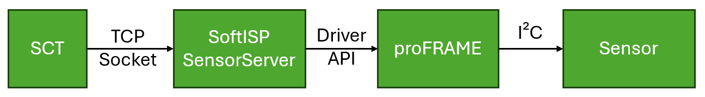
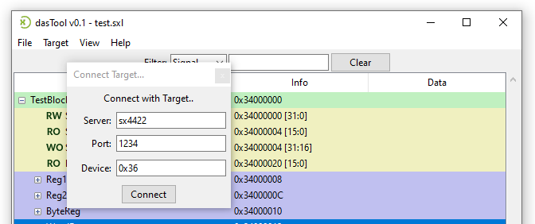
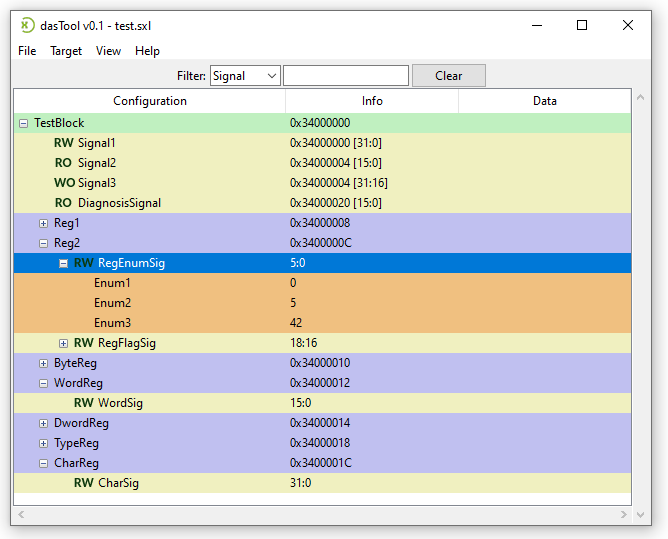
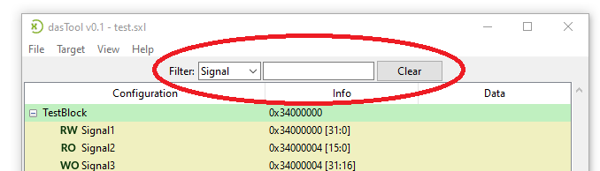

# Solectrix SXIVE Sensor Configuration Tool

- [Solectrix SXIVE Sensor Configuration Tool](#solectrix-sxive-sensor-configuration-tool)
  - [Quickstart](#quickstart)
  - [Requirements](#requirements)
  - [Installation](#installation)
  - [Sensor Register Description File Format (SXL)](#sensor-register-description-file-format-sxl)
  - [Use SXIVE SoftISP for Sensor Communication](#use-sxive-softisp-for-sensor-communication)
  - [SXIVE SCT Usage](#sxive-sct-usage)

## Quickstart

- Install the software requirements: [Installation](#installation)
- Create a sensor register description SXL file for the sensor you want to configure: [How to create SXL files](#sensor-register-description-file-format-sxl)
- Connect the sensor to the proFRAME grabber card.
- Start a SXIVE SoftISP instance as backend for the sensor communication [Use SXIVE SoftISP for Sensor Communication](#use-sxive-softisp-for-sensor-communication)
- Start the Sensor Config Tool.
- Click the "Target->Open Target" menu in SXIVE SCT to connect to the running SoftISP instance via socket.
- Click the "File->Open" menu in SXIVE SCT to load a register description SXL file. See [How to create SXL files](#sensor-register-description-file-format-sxl).
- Click on a register or a group of registers and press `F1` to read the register values from the sensor.
- Click on a register and press `F2` to modify the register. Please note that only registers which are marked as "writable" in the register description file can be changed.

## Requirements

The SXIVE Sensor Configuration Tool (SXIVE SCT) is written in Python and builds on the Solectrix SXIVE SoftISP as backend for the sensor communication. SXIVE SCT can connect remotely to a machine running a SXIVE SoftISP instance acting as sensor server. Therefore the requirements are split into requirements for the sensor server and SXIVE SCT itself.

**Sensor Server**
- a Solectrix proFRAME PCIe frame grabber card including an adapter card which matches the serializer of the camera head for which you want to configure the sensor.
- an installed Solectrix SXIVE SoftISP on the system where the proFRAME is installed. Please note that SXIVE SoftISP is currently only available for Linux.

**SXIVE SCT**
- a Python interpreter for running SXIVE SCT, see section [Installation](#installation) on how to install.
- a sensor register description (.sxl) file for the sensor you want to configure. You can create the SXL file based on the register map description of the sensor. Please contact the sensor or camera head manufacturer for the register map description.

## Installation

SXIVE SCT is based on Python. Follow the steps below for installation.

1. Download SXIVE SCT software package from the repository.
  
2. Install Python version >= 3.10, earlier versions work but may show small visual impairments of the UI
   - Linux: Most likely, your Linux distribution comes with a pre-installed Python version.
   - Windows: Get an install package from here: https://www.python.org/downloads/

3. Use the Python tool `pip` to install the required Python packages: 
   - Linux: `pip3 install -r requirements.txt`
   - Windows: `pip install -r requirements.txt`

4. Please refer to SXIVE SoftISP manual on how to install the software and the proFRAME driver.

## Sensor Register Description File Format (SXL)
 You can find a detailed description of the SXL format [here](./doc/sxl_description.md).

## Use SXIVE SoftISP for Sensor Communication

SXIVE SCT uses the Solectrix SXIVE SoftISP and the proFRAME grabber card as backend for the communication with the sensor. SXIVE SoftISP provides a socket interface for communication with SXIVE SCT. Using the socket interface the tool issues read and write I2C commands to the sensor. As the interface is socket based it is possible to run the tool on a different machine than SXIVE SoftISP by remote access.

You can use one of the two following SXIVE SoftISP tools for setting up the communication with the sensor:

**SXIVE SoftISP Tool**

The SXIVE SoftISP tool automatically starts a sensor server. If you want to record or process the sensor image stream while reading/modifying the sensor configuration use the SoftISP tool:

`SoftISP -c $CONFIG proframe3 $OUTPUT --channel $CHANNEL [-d]`

- `-c $CONFIG`: The path to the SXIVE SoftISP config JSON file for the sensor you want to configure.
- `proframe3`: The typical input driver name from the SXIVE SoftISP config file for the proframe input driver. It is mandatory to use the proframe input driver for the communication with the sensor.
- `$OUTPUT`: The output driver name from the SXIVE SoftISP config file, e.g. `gui` for displaying the output image on the screen
- `--channel $CHANNEL`: The proFRAME channel number on which the sensor is connected. Please refer to the SXIVE SoftISP documentation for the numbering of the proFRAME channels.
- `-d`: Optionally, add the `-d` argument if the sensor is already initialized. Omitting the `-d` argument will run the sensor initialization according to the config file.

When you start SXIVE SoftISP with the `-v` option it will log the port number to the console, e.g. "SocketServer listening on port 1234".

**SensorServer Tool**

If you don't want to process or record the image stream you can use the SXIVE SensorServer tool. The command uses the same arguments as SXIVE SoftISP except for the omitted output:

`SensorServer -c $CONFIG proframe3 --channel $CHANNEL [-d] --server_port $SOCKET_PORT`
- `--server_port $SOCKET_PORT`: The SensorServer tool provides the option to change the TCP port number for the socket interface server. The default is 1234.

For further information regarding SXIVE SoftISP or SensorServer usage please refer to the SXIVE SoftISP manual.

## SXIVE SCT Usage

This section describes how to use SXIVE SCT after the sensor is initialized, a sensor server backend provided by one of the SXIVE SoftISP tools is running and a register description SXL file has been created.

**Connect to the sensor server**

This section uses sensor server as a name for one of the tools described in section [Use SXIVE SoftISP for Sensor Communication](#sensor-register-description-file-format-sxl).

- Click the "Target->Open Target..." menu in SXIVE SCT.
- Set the IP address or the hostname of the machine on which the sensor server is running. If it is running on the same machine as SXIVE SCT you can use "localhost".
- Set the port number for the sensor server. See section [Use SXIVE SoftISP for Sensor Communication](#sensor-register-description-file-format-sxl) on how to find the port number.
- The sensor device address can be specified in the register description SXL file. But you can also overwrite the sensor device address while connecting to the sensor server. Leave the "Device" field blank or set it to the I2C address.
- If the connection fails, make sure that the sensor server is running, that the port number of the sensor server is correct. If SXIVE SCT is running on a different machine than the sensor server, make sure that a network connection exists between both machines and that no firewalls or other middle boxes prevent TCP connections. Additionally, check if choosing a different sensor server port solves the problem.

**Load an SXL File**

- Click the "File->Load" menu in SXIVE SCT.
- Browse to the folder containing the SXL for the sensor you want to configure and select the file.

**Browse definitions**

After loading an SXL file the whole sensor register description is displayed as tree view in the center of SXIVE SCT. 
Sensor registers are typically grouped together in function sub-blocks. You can open a block by clicking the "+" symbol in the register tree view of SXIVE SCT. The lowest hierarchy level is the sensor signal which represents a logical data unit of a specific type, e.g. an integer value or a flag. Please refer to section [Sensor Register Description File Format (SXL)](#sensor-register-description-file-format-sxl) for a detailed description of the SXL syntax and structure.

The address of the registers are displayed in the "Info" merged together with the device address. See section [Sensor Register Description File Format (SXL)](#sensor-register-description-file-format-sxl) on how to interpret the address.

**Read signal values**

You can read a sensor register value by selecting it in the tree view and pressing the `F1` key. The register value will be displayed in the "Data" column of the tree view. The raw value is interpreted according to the type description of the register in the SXL file. See section [Sensor Register Description File Format (SXL)](#sensor-register-description-file-format-sxl).

Similarly, you can read all registers of a sub-block by selecting the sub-block in the tree view and press the `F1` key.

**Modify signal values**

You can change the value of a signal by selecting it in the tree-view and by pressing the `F2` key. If the signal is a single bit, the value will toggle its state. If the value is of larger size, a simple toolbox will open allowing you to set the proper new value. In case of enums, the signal value will be changed to the value seen in the 'info' column. As alternative to the `F2` key, you can also double-click the left mouse button.

**Filter**

You can restrict available tree view items using the filter field above the tree view. Only registers/signals whose name matches the entered string are displayed. The filter entry field will be handled by a regular expression. The filter type can be one of *Signal*, *Register*, or *Tag*. The default filter regular expression for signals and registers is \*\<phrase\>\*, ignoring heading and tailing characters of the given phrase. Name matching is case insensitive in any case. You can work with asterisks (*) or question marks (?) as a placeholder for multiple or single masked characters.

*Hint*: Our parser examples for chosen SONY sensors define Category tags. A Category identifier is used by the SONY definitions for functional grouping of signals. When filtering such tags, e.g. "Category:42", the full tree is reduced to signals that belong to that functional group. You can tags during SXL file generation for any kind of grouping purposes you prefer.

**I2C Addresses in Context of SXIVE SCT**

The device and sensor I2C adressess are merged into a single 32bit address in the context of SXIVE SCT.
The most significant byte is the 8bit device address, the least significant bytes are the 8 or 16bit register address of the device itself.
E.g. 0x36001234 describes a device address of 0x36 and a register address of 0x1234.
