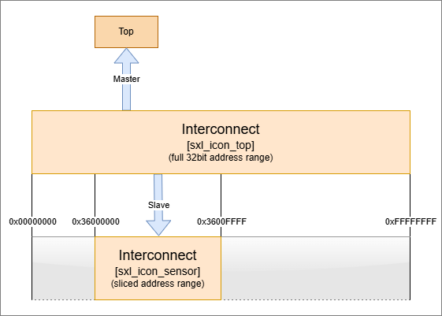
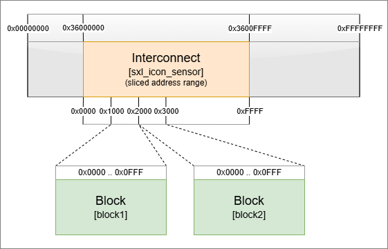
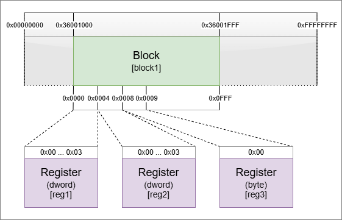
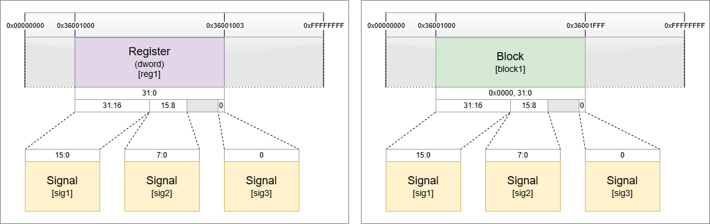

# Creation of SXL files

## Data structure

SXL is a custom structured data format evolved by Solectrix for our very own tool workflows. One particular use case is the description of an address space in a top-down fashion from block separation down to the declaration of contents of single bits.

Talking about image sensor devices, the complexity of user interface description have become huge these days. Sensors can be fully packed with functions and controllers that need to be configured. The amount of information about the addressable units inside such a device can be translated into a human-readable text file, but in a structured fashion for use in helpful applications and tools, to make it an intermediate file format for various needs.

To visualize the supported hierarchy:


Supported are two possible hierarchies that somehow depend on the way the sensor description is organized. The usage of registers is optional, but may be useful if there are register names and underlying signals with further signal names. Registers act as addressable carriers for data to give it a data width or type. The access method to the device on a lower transfer level is defined, and the expected query requests can be generated. The same can be achieved without registers, while signals need to be linked to an address without knowledge of the underlying implicit access method. Since the main interface type for sensor I/O will be I<sup>2</sup>C, the access mode granularity will always be byte-aligned and therefore unproblematic.

**SXL definitions with Python**

The SXL Python package will help to create and manage definitions in a very easy way. In the following, the hierarchy and its pythonic way of defining SXL elements are described in detail.

Notes:
- All data are strings when generating SXL with the Python SXL package
- The purpose of attributes should be understood. An attribute "addr" for example will be used to define an integer number typically in a hexadecimal notation. The consuming application will then try to parse the data in an appropriate manner.
- There are no sanity checks. You can define complete nonsense. But don't expect the consuming application to act benevolent. If data cannot be used in the intended context, undefined behavior can occur.

### Hint

Beside using the image sensors for remote signal access, it can also be considered to include serializers/deserializers into an SXL definition. Devices are bound to the 32bit address of SXIVE by the given I<sup>2</sup>C address of the configuration bus. Other devices accessible on the same bus can be included in the same way into one complete system definition in SXL with all available devices.

### Coding Examples

As the definition of registers is offered by image sensor vendors in different styles, there is no straight forward path to convert definitions into SXL. Aside from the format, it also interferes the interest of the vendor how information are spread to their customers and are often limited in the amount of information being published. Therefore, Solectrix can and will not spread register definitions of vendors in any way. 

As a coding reference, we deliver functional register file parsers as conversion examples, that are already tested by us.


## SXL types

The toplevel of an SXL definition is the SXL root. To create one in python:

```python
from sxl import Sxl, SxlRoot

sxl_root = SxlRoot()
```

*Sxl* is an identifier class that contains the supported SXL elements. *SxlRoot* is a class to administer the SXL definition structure. Additionally, it offers maintenance functions, like *Load()* and *Save()* for SXL file handling.

To create a new SXL object, we use the *new()* member function of any SXL object that we want to create a new subelement for. Function *new()* requires arguments: [1] SXL type, [2] name/identifier, [3]optional: attributes. Attributes are SXL type dependent and may have their assumed defaults.

### SXL Interconnect

An interconnect is usually found in complex circuits, where a defined address space is split into partial address spaces to separate functional groups. In SXL, these smaller chunks can be either further interconnects or so-called *Blocks* that have a very custom register layout, start with a defined offset address, and have a data size. To use an interconnect, you need at least one master port and one slave port. The slave configuration defines the address offset and block size of the new slice. The slave describes an interface and may link to a block with further detailed signal definitions.

To create an *Icon* in python:

```python
sxl_icon_top    = sxl_root.new(Sxl.Icon, "top")
sxl_icon_sensor = sxl_root.new(Sxl.Icon, sensor_id)
```

In our case, we use two interconnects. The first icon 'sxl_icon' with name 'sensor' shall link an underlying register map of a sensor. The second icon 'sxl_icon_top' with name 'top' shall be the top of the address space.



Both interconnects will be connected by a virtual link of a later created slave port with a base address offset. This is done to make sure all registers and signals will get a common address offset of the whole definitions.

#### Attributes
|Name|Mnemonics|
|----|---------|
|desc|(*Optional*) Description of an interconnect.|

### SXL Master

The *Master* port generally has the identifier of the icon to make sure a slave can connect to another interconnect by a master port. In our case, we just need one port for each instance of an *Icon*.

```python
sxl_icon_top.new(Sxl.Mst, name="top",
                 dict(desc="top level of address space"))
sxl_icon_sensor.new(Sxl.Mst, name=sensor_id,
                    dict(desc=f"top of '{sensor_id}' for address space compilation"))
```

By hierarchy, the SXL Master object is a child of a SXL Interconnect object.

#### Attributes
|Name|Mnemonics|
|----|---------|
|desc|(*Optional*) Description of a master port.|

### SXL Slave

An SXL Slave is an output node of an interconnect. The slave port defines how the address range is split into a smaller chunk. In the following example, the interconnect of the full range interconnect is a small 16bit range with a base offset address of 0x36000000 with size 0x10000.

The new object's attribute "init" defines a link to the Master port of another Interconnect. For the sake of a clean hierarchy definition, it helps to give Interconnect, Master Port and Slave port the same name identifier.

In case of a SXL Slave with type SXL Block, it is linked with the attribute "block" and the name of the block. Same here, the name of the SXL Slave should be equal to the SXL Block to prevent confusion.

```python
sxl_icon_top.new(Sxl.Slv, name=sensor_id,
                 dict(icon=sensor_id,       # create symbolic link to an icon with name sensor_id
                      addr="0x36000000",    # address offset of the sensor device
                      size="0x00010000"))   # size of the sensor device
sxl_icon_sensor.new(Sxl.Slv, name="Block1",
                    dict(block="Block1",    # create symbolic link to a block with name "Block1"
                         addr ="0x1000",    # address offset of the block within the underlying address space
                         size ="0x1000"))   # size of the block within the underlying address space
```

By hierarchy, the SXL Slave object is a child of a SXL Interconnect object.

#### Attributes
|Name|Mnemonics|
|----|---------|
|desc|(*Optional*) Description of a master port.|

### SXL Block

The SXL Block is an address chunk that can be mapped into a larger address domain. The SXL Block does not have its own address but is assigned one by the Slave binding. Only the attribute is "size" to define an extent of the block. Another attribute "desc" is optional and 



The SXL Block will be defined as child of the SXL root object.

```python
block1 = sxl_root.new(Sxl.Block, "block1",
                      {"size": "0x1000",
                       "desc": "Block 1 of the sensor hierarchy"})
block2 = sxl_root.new(Sxl.Block, "block2",
                      {"size": "0x1000",
                       "desc": "Block 2 of the sensor hierarchy"})
```

#### Attributes
|Name|Mnemonics|
|----|---------|
|desc|(*Optional*) Description of a master port.|
|size|<Mandatory> Byte size of the SXL Block.|
|tags|(*Optional*) List of tags separated by space, can be used for signal filtering or application specific grouping.|

### SXL Register

The SXL Register is considered optional, depending on the way the sensor hierarchy is documented. It serves as addressable data word unit and can be either "dword" (32bit, default), "word" (16bit) or "byte" (8bit). The register has another address offset with attribute "addr" referring to the SXL Block start address. All physical data I/O will use this data element to access data.



```python
reg2 = block1.new(Sxl.Reg, name="reg2",
                  dict(addr="0x0004",
                       desc="Register carrier for signals of default dword type"))
reg3 = block1.new(Sxl.Reg, name="reg3",
                  dict(addr="0x0008",
                       type="byte",
                       desc="Register carrier for signals of type 'byte'"))
```

#### Attributes
|Name|Mnemonics|
|----|---------|
|desc|(*Optional*) Description of a master port.|
|addr|(**Mandatory**) Offset address of the SXL register inside SXL Block address range.|
|type|(*Optional*) Data type of the SXL Register. One of ['byte', 'word', 'dword']. Defaults to 'dword' if not set.|
|tags|(*Optional*) List of tags separated by space, can be used for signal filtering or application specific grouping.|

### SXL Signal

The SXL Signal is the representation of a specified parameter value of the sensor domain. It can be either a child of a SXL Block, or a child of a SXL Register. In case the addressable unit SXL Register is not used, it needs the additional "addr" attribute.



```python
# signal of a register
sig1 = reg1.new(Sxl.Sig, name="sig1",
                  dict(pos ="31:16",    # bit position in reference to address of register
                       type="U4.12"     # define signal to be interpret as U4.12 fixed point
                       desc="Signal of a U4.12 fixed point number"))
# signal of a block, needs the offset address additionally
sig2 = block2.new(Sxl.Sig, name="sig2",
                  dict(addr="0x0000",   # offset address inside block's address range
                       pos ="15:8",     # bit position in reference to given address
                       mode="ro",       # read-only declaration of the signal
                       type="enum",     # signal type, here: enum
                       desc="Signals of type 'enum'"))
```

#### Attributes
|Name|Mnemonics|
|----|---------|
|desc|(*Optional*) Description of a master port.|
|addr|If child of SXL Block: (**Mandatory**) Offset address of the SXL register inside SXL Block address range.</br>If child of SXL Register: Not relevant.|
|pos|(**Mandatory**) Bit range of signal inside underlying addressable unit. **TODO: REVIEW**|
|mode|(*Optional*) Access mode to this signal. One of ['rw', 'ro', 'wo', 't']. <ul><li>'rw': read/write</li><li>'ro': read-only</li><li>'wo': write-only</li><li>'t': trigger</li></ul>Defaults to 'rw' if not set.|
|type|(*Optional*) Data type of the signal to interpret the signal's value. </br>Supported types:</br><ul><li>'enum': Mark signal as Enum. Requires definition of child SXL Enum objects.</li><li>'flag': Mark signal as Flag. Requires definition of child SXL Flag objects.</li><li>'[U\|S]\<n\>[.\<m\>]': Fixed point value. U=unsigned, S=signed, \<n\>=number of digits before the decimal point, \<m\>=number of decimal places.</li></ul>Defaults to 'U'.|
|tags|(*Optional*) List of tags separated by space, can be used for signal filtering or application specific grouping.|

### SXL Enum

An enum signal type reduces a signal value to a number of registered values being set. When enums are used, the underlying signal <u>must</u> be defined as type 'enum'.

```python
sig2.new(Sxl.Enum, name="Some_State",
         dict(value="1",
              desc ="Enum with value 1"))
sig2.new(Sxl.Enum, name="Another_State",
         dict(value="2",
              desc ="Enum with value 2"))
```

#### Attributes
|Name|Mnemonics|
|----|---------|
|desc|(*Optional*) Description of a master port.|
|value|(**Mandatory**) Defined value representation of a signal value.|
|tags|(*Optional*) List of tags separated by space, can be used for signal filtering or application specific grouping.|

### SXL Flag

Flags are a simple resolution of one-hot state vectors. Single bits that correspond to an internal state are extracted and presented as single state component. When flags are used, the underlying signal <u>must</u> be defined as type 'flag'.

```python
sig3.new(Sxl.Flag, name="ErrorFlag",
         dict(pos="0",
              desc ="Flag 0 of a state vector indicating an error"))
sig3.new(Sxl.Flag, name="ResetState",
         dict(pos="1",
              desc ="Flag 1 of a state vector indicating a reset state"))
```

#### Attributes
|Name|Mnemonics|
|----|---------|
|desc|(*Optional*) Description of a master port.|
|pos|(**Mandatory**) Bit position within underlying signal.|
|tags|(*Optional*) List of tags separated by space, can be used for signal filtering or application specific grouping.|
